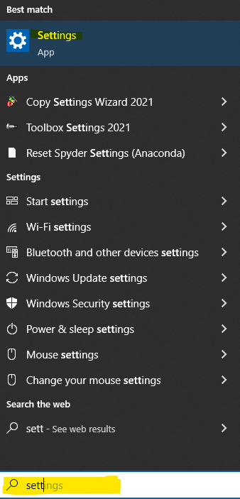
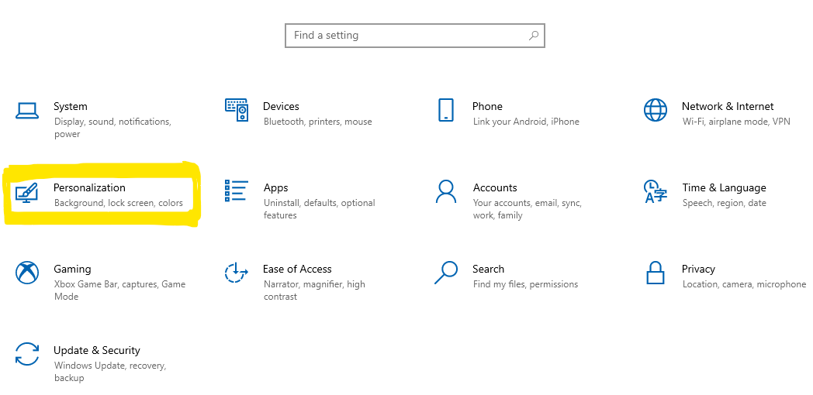
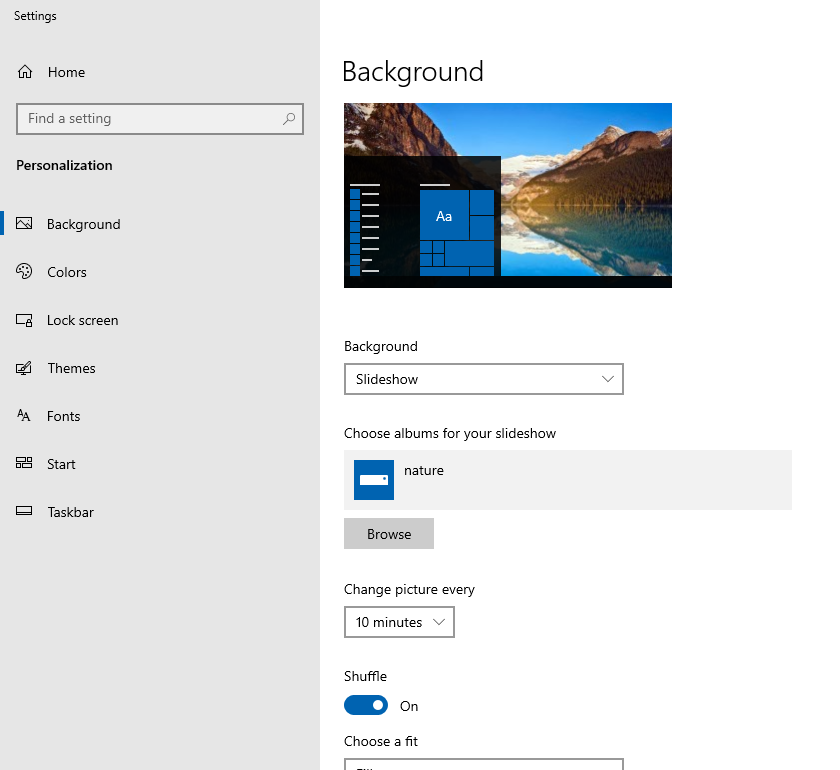
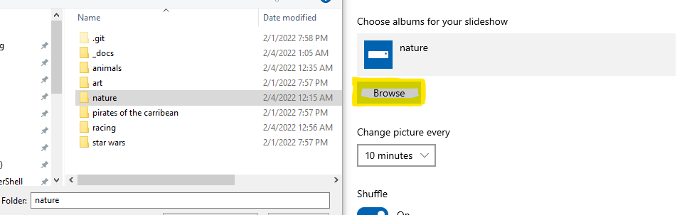

# How to Set Up you Background Slideshow

## Open the Settings App

- Hit the *Windows* Key or click the *Search Bar* at the bottom left.
- Search for *Settings* and run the app.
  
  

## Navigate to Personalization Settings

- In the *Settings* app, search or click *Personalization*.
  
  

## Navigate to Background Settings

- Search or click on the left side for *Background* settings.
  
  

## Choose Your Background Images Folder

- Under *Background* settings, select the dropdown and choose *Slideshow*.
- Now under the gray box, choose *Browse*.
- Navigate to your folder and select it.

  

You're Done!
